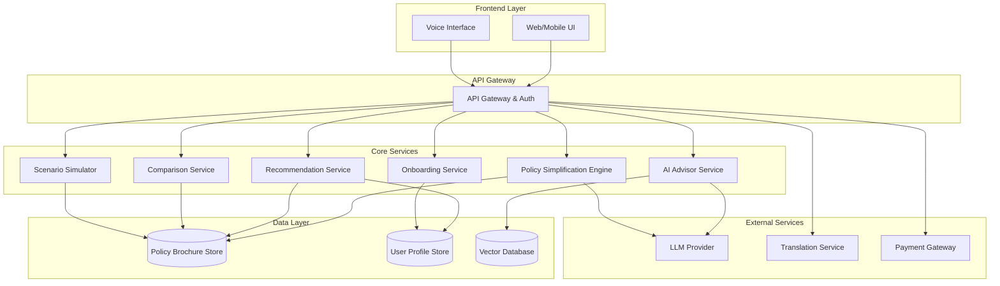

# Design Document: InsureX

## Overview

InsureX is an AI-powered insurance understanding and purchase platform that transforms the insurance buying experience from sales-first to understanding-first. The platform architecture is built around three core principles:

1. **Single Source of Truth**: All AI responses are grounded exclusively in official policy brochures
2. **Low Cognitive Load**: Guided journeys with minimal questions and clear visual hierarchies
3. **Trust Through Transparency**: Explainable recommendations with source citations and no hidden charges

The system uses a microservices architecture with clear separation between the AI reasoning layer, policy data management, user journey orchestration, and external integrations. The AI Advisor acts as a neutral guide rather than a sales agent, with all recommendations traceable to specific policy document sections.

## Architecture

### High-Level Architecture



### Service Responsibilities

**Onboarding Service**
- Manages conversational onboarding flow
- Collects life-stage, risk profile, and basic needs
- Generates and stores Need_Profile
- Adapts questions based on user responses

**AI Advisor Service**
- Processes natural language queries
- Retrieves relevant policy sections using RAG (Retrieval-Augmented Generation)
- Generates explanations grounded in policy brochures
- Maintains conversation context
- Provides source citations for all responses

**Policy Simplification Engine**
- Parses and extracts structured data from policy brochures
- Converts complex policy language to simple terms
- Generates examples and scenarios
- Highlights critical exclusions and conditions
- Maintains semantic accuracy during simplification

**Recommendation Service**
- Matches policies to user Need_Profile
- Calculates suitability scores
- Generates "why recommended" and "why not recommended" explanations
- Updates recommendations based on preference changes
- Ranks policies by relevance

**Comparison Service**
- Generates side-by-side policy comparisons
- Highlights key differences
- Produces visual indicators (color coding, heatmaps)
- Generates trade-off summaries
- Supports up to 4 policies simultaneously

**Scenario Simulator**
- Simulates real-life insurance scenarios
- Calculates coverage outcomes for each policy
- Shows covered amounts, exclusions, and out-of-pocket costs
- Supports custom scenario creation
- Compares outcomes across multiple policies

## Components and Interfaces

### 1. Onboarding Service

**Interface: OnboardingAPI**
```typescript
interface OnboardingAPI {
  startOnboarding(userId: string): OnboardingSession
  submitAnswer(sessionId: string, questionId: string, answer: Answer): NextQuestion
  completeOnboarding(sessionId: string): NeedProfile
  getProgress(sessionId: string): OnboardingProgress
}

interface OnboardingSession {
  sessionId: string
  userId: string
  startedAt: timestamp
  currentStep: number
  totalSteps: number
}

interface Answer {
  questionId: string
  value: string | number | string[]
  timestamp: timestamp
}

interface NextQuestion {
  questionId: string
  questionText: string
  questionType: 'single-choice' | 'multi-choice' | 'text' | 'number'
  options?: string[]
  validationRules: ValidationRule[]
}

interface NeedProfile {
  userId: string
  lifeStage: 'young-professional' | 'family' | 'pre-retirement' | 'retired'
  riskProfile: 'low' | 'medium' | 'high'
  budget: MoneyRange
  priorities: string[]
  dependents: number
  existingCoverage: Coverage[]
}
```

### 2. AI Advisor Service

**Interface: AIAdvisorAPI**
```typescript
interface AIAdvisorAPI {
  askQuestion(userId: string, question: string, context: ConversationContext): AIResponse
  explainPolicy(policyId: string, aspect: PolicyAspect): Explanation
  getRecommendationReasoning(policyId: string, needProfile: NeedProfile): Reasoning
}

interface ConversationContext {
  conversationId: string
  previousMessages: Message[]
  currentPolicies: string[]
  userProfile: NeedProfile
}

interface AIResponse {
  answer: string
  sources: SourceCitation[]
  confidence: number
  followUpSuggestions: string[]
}

interface SourceCitation {
  policyId: string
  policyName: string
  section: string
  pageNumber: number
  excerpt: string
}

interface Explanation {
  simplifiedText: string
  examples: string[]
  keyPoints: string[]
  exclusions: string[]
  sources: SourceCitation[]
}

interface Reasoning {
  whyRecommended?: string[]
  whyNotRecommended?: string[]
  suitabilityScore: number
  matchedNeeds: string[]
  unmatchedNeeds: string[]
}
```

### 3. Policy Simplification Engine

**Interface: PolicySimplificationAPI**
```typescript
interface PolicySimplificationAPI {
  simplifyPolicy(policyId: string): SimplifiedPolicy
  extractKeyTerms(policyId: string): PolicyTerms
  generateExamples(policyId: string, coverage: string): Example[]
}

interface SimplifiedPolicy {
  policyId: string
  summary: string
  coverageInclusions: CoverageItem[]
  coverageExclusions: CoverageItem[]
  waitingPeriods: WaitingPeriod[]
  conditions: Condition[]
  premiumStructure: PremiumInfo
}

interface CoverageItem {
  name: string
  description: string
  simplifiedDescription: string
  amount: Money
  examples: string[]
  importance: 'critical' | 'important' | 'standard'
}

interface WaitingPeriod {
  coverage: string
  duration: Duration
  explanation: string
}

interface Condition {
  type: 'pre-existing' | 'age-limit' | 'medical-exam' | 'other'
  description: string
  impact: string
}

interface Example {
  scenario: string
  outcome: string
  coveredAmount: Money
  outOfPocket: Money
}
```

### 4. Recommendation Service

**Interface: RecommendationAPI**
```typescript
interface RecommendationAPI {
  getRecommendations(needProfile: NeedProfile): PolicyRecommendation[]
  updateRecommendations(needProfile: NeedProfile, preferences: Preferences): PolicyRecommendation[]
  explainRanking(policyId: string, needProfile: NeedProfile): RankingExplanation
}

interface PolicyRecommendation {
  policy: Policy
  suitabilityScore: number
  rank: number
  whyRecommended: string[]
  matchedCriteria: Criterion[]
  gaps: string[]
  estimatedPremium: Money
}

interface Preferences {
  maxPremium?: Money
  preferredCoverage?: string[]
  excludedFeatures?: string[]
  insurerPreference?: string[]
}

interface RankingExplanation {
  scoringFactors: ScoringFactor[]
  comparisonToOthers: string
  strengthsAndWeaknesses: string[]
}

interface ScoringFactor {
  factor: string
  weight: number
  score: number
  explanation: string
}
```

### 5. Comparison Service

**Interface: ComparisonAPI**
```typescript
interface ComparisonAPI {
  comparePolicies(policyIds: string[]): PolicyComparison
  generateTradeoffSummary(policyIds: string[]): TradeoffSummary
  highlightDifferences(policyIds: string[]): DifferenceHighlight[]
}

interface PolicyComparison {
  policies: Policy[]
  comparisonMatrix: ComparisonRow[]
  visualIndicators: VisualIndicator[]
  summary: string
}

interface ComparisonRow {
  aspect: string
  category: 'coverage' | 'exclusion' | 'premium' | 'waiting-period' | 'condition'
  values: ComparisonValue[]
}

interface ComparisonValue {
  policyId: string
  value: string | number | Money
  rating: 'best' | 'good' | 'average' | 'poor'
  explanation: string
}

interface TradeoffSummary {
  keyTradeoffs: Tradeoff[]
  bestFor: Record<string, string> // scenario -> policyId
  overallRecommendation: string
}

interface Tradeoff {
  aspect: string
  policy1: string
  policy2: string
  description: string
  impact: 'high' | 'medium' | 'low'
}
```

### 6. Scenario Simulator

**Interface: ScenarioSimulatorAPI**
```typescript
interface ScenarioSimulatorAPI {
  simulateScenario(scenario: Scenario, policyIds: string[]): SimulationResult[]
  createCustomScenario(userId: string, scenarioDetails: ScenarioDetails): Scenario
  getPresetScenarios(insuranceType: string): Scenario[]
}

interface Scenario {
  scenarioId: string
  name: string
  description: string
  insuranceType: 'health' | 'life' | 'auto' | 'home'
  parameters: ScenarioParameter[]
}

interface ScenarioParameter {
  name: string
  value: string | number
  unit?: string
}

interface SimulationResult {
  policyId: string
  policyName: string
  outcome: CoverageOutcome
  breakdown: CostBreakdown
  explanation: string
}

interface CoverageOutcome {
  isCovered: boolean
  coveredAmount: Money
  excludedItems: string[]
  conditions: string[]
}

interface CostBreakdown {
  totalCost: Money
  coveredByInsurance: Money
  outOfPocket: Money
  deductible: Money
  copay: Money
  itemizedCosts: LineItem[]
}
```

## Data Models

### Core Entities

**User**
```typescript
interface User {
  userId: string
  email: string
  phoneNumber: string
  preferredLanguage: string
  createdAt: timestamp
  lastLoginAt: timestamp
  needProfile?: NeedProfile
  loyaltyPoints: number
  loyaltyTier: 'bronze' | 'silver' | 'gold' | 'platinum'
}
```

**Policy**
```typescript
interface Policy {
  policyId: string
  insurerId: string
  insurerName: string
  policyName: string
  insuranceType: 'health' | 'life' | 'auto' | 'home'
  brochureUrl: string
  brochureVersion: string
  uploadedAt: timestamp
  lastUpdatedAt: timestamp
  structuredData: PolicyStructuredData
  vectorEmbeddings: number[][]
}

interface PolicyStructuredData {
  summary: string
  coverageDetails: Coverage[]
  exclusions: Exclusion[]
  premiumRanges: PremiumRange[]
  eligibilityCriteria: Criterion[]
  claimProcess: string
  waitingPeriods: WaitingPeriod[]
}
```

**PurchasedPolicy**
```typescript
interface PurchasedPolicy {
  purchaseId: string
  userId: string
  policyId: string
  purchaseDate: timestamp
  startDate: timestamp
  endDate: timestamp
  premium: Money
  paymentFrequency: 'monthly' | 'quarterly' | 'annual'
  status: 'active' | 'expired' | 'cancelled'
  renewalReminderSent: boolean
  documents: PolicyDocument[]
}
```

**VerifiedAdvisor**
```typescript
interface VerifiedAdvisor {
  advisorId: string
  name: string
  email: string
  phoneNumber: string
  experience: number // years
  specializations: string[]
  regions: string[]
  languages: string[]
  credentials: Credential[]
  rating: number
  reviewCount: number
  isVerified: boolean
  verifiedAt: timestamp
}
```

**Conversation**
```typescript
interface Conversation {
  conversationId: string
  userId: string
  startedAt: timestamp
  lastMessageAt: timestamp
  messages: Message[]
  context: ConversationContext
}

interface Message {
  messageId: string
  role: 'user' | 'assistant'
  content: string
  timestamp: timestamp
  sources?: SourceCitation[]
}
```

## Data Flow Examples

### 1. User Onboarding Flow

```
User → UI → API Gateway → Onboarding Service
                              ↓
                         User Profile Store
                              ↓
                         Need Profile Generated
                              ↓
                    Recommendation Service
                              ↓
                    Initial Policy Recommendations
```

### 2. AI Query Processing Flow

```
User Question → API Gateway → AI Advisor Service
                                    ↓
                              Vector Database (RAG)
                                    ↓
                              Retrieve Relevant Sections
                                    ↓
                              LLM Provider
                                    ↓
                              Generate Grounded Response
                                    ↓
                              Add Source Citations
                                    ↓
                              Return to User
```

### 3. Policy Comparison Flow

```
User Selects Policies → Comparison Service
                              ↓
                        Policy Brochure Store
                              ↓
                        Extract Comparison Data
                              ↓
                        Generate Visual Indicators
                              ↓
                        AI Advisor (Trade-off Summary)
                              ↓
                        Return Comparison View
```


## Correctness Properties

*A property is a characteristic or behavior that should hold true across all valid executions of a system—essentially, a formal statement about what the system should do. Properties serve as the bridge between human-readable specifications and machine-verifiable correctness guarantees.*

### Property Reflection

After analyzing all acceptance criteria, I identified several areas where properties can be consolidated to avoid redundancy:

- **Source Citation Properties (2.3, 8.2, 8.5)**: These all relate to providing source references. Combined into a single comprehensive property about citation completeness.
- **Explanation Properties (4.2, 4.3, 8.1)**: These all require explanations to be present. Combined into a property about explanation completeness for recommendations.
- **Data Completeness Properties (3.1, 5.2, 6.3, 9.1, 14.2)**: Multiple properties check that required fields are present. Consolidated by domain (policy extraction, comparison, simulation, advisor profiles).
- **Storage Properties (10.2, 10.4)**: Both relate to policy locker functionality. Combined into a single property about policy storage and retrieval.
- **Consent Properties (9.4, 11.2)**: Both require explicit consent before data sharing. Combined into a single property.

### Core Properties

**Property 1: Onboarding Question Adaptation**
*For any* life-stage value provided during onboarding, the subsequent questions generated should be contextually appropriate for that life-stage and different from questions for other life-stages.
**Validates: Requirements 1.3**

**Property 2: Need Profile Generation**
*For any* completed onboarding session with all required answers, a Need_Profile should be generated containing all mandatory fields (lifeStage, riskProfile, budget, priorities).
**Validates: Requirements 1.4**

**Property 3: Response Grounding in Source Documents**
*For any* AI Advisor response to a policy query, all factual claims in the response should be traceable to content in the uploaded Policy_Brochures.
**Validates: Requirements 2.1**

**Property 4: Source Citation Completeness**
*For any* AI Advisor explanation about policy coverage or details, the response should include valid source citations with policyId, section, and excerpt from the Policy_Brochure.
**Validates: Requirements 2.3, 8.2, 8.5**

**Property 5: Out-of-Scope Query Handling**
*For any* query that cannot be answered from available Policy_Brochures, the AI Advisor response should explicitly indicate that the information is not available in source documents.
**Validates: Requirements 2.4**

**Property 6: Policy Data Extraction Completeness**
*For any* processed Policy_Brochure, the extracted structured data should contain all required fields: inclusions, exclusions, waiting periods, conditions, and premium structure.
**Validates: Requirements 3.1, 14.2**

**Property 7: Coverage Examples Generation**
*For any* coverage explanation generated by the Policy_Simplification_Engine, the explanation should include at least one real-world example or scenario.
**Validates: Requirements 3.3**

**Property 8: Critical Exclusion Identification**
*For any* simplified policy, critical exclusions should be identified and marked with importance level 'critical' in the structured output.
**Validates: Requirements 3.4**

**Property 9: Recommendation Matching**
*For any* Need_Profile with specified budget and priorities, all recommended policies should have premiums within the budget range and coverage matching at least one priority.
**Validates: Requirements 4.1**

**Property 10: Recommendation Explanation Completeness**
*For any* policy recommendation (recommended or not recommended), an explanation should be present indicating why the policy matches or doesn't match the user's needs.
**Validates: Requirements 4.2, 4.3, 8.1**

**Property 11: Recommendation Update on Preference Change**
*For any* Need_Profile, if preferences are modified (budget, coverage priorities), the resulting recommendations should differ from the original recommendations.
**Validates: Requirements 4.4**

**Property 12: Recommendation Ranking Order**
*For any* set of policy recommendations, the policies should be ordered by descending suitability score (highest score first).
**Validates: Requirements 4.5**

**Property 13: Comparison Data Completeness**
*For any* policy comparison, the comparison matrix should include all key aspects: coverage, exclusions, premiums, waiting periods, and conditions for each policy.
**Validates: Requirements 5.2**

**Property 14: Comparison Visual Indicators**
*For any* policy comparison, each comparison value should have an associated rating indicator (best, good, average, poor) to highlight differences.
**Validates: Requirements 5.3**

**Property 15: Trade-off Summary Generation**
*For any* policy comparison with 2 or more policies, a trade-off summary should be generated identifying key differences and their impact.
**Validates: Requirements 5.4**

**Property 16: Comparison Policy Limit**
*For any* comparison request, the system should accept up to 4 policies and reject requests with more than 4 policies.
**Validates: Requirements 5.5**

**Property 17: Scenario Simulation Result Generation**
*For any* scenario and policy combination, the Scenario_Simulator should generate a simulation result with coverage outcome and cost breakdown.
**Validates: Requirements 6.1, 6.2**

**Property 18: Simulation Outcome Completeness**
*For any* simulation result, the coverage outcome should include all required fields: isCovered, coveredAmount, excludedItems, and outOfPocket costs.
**Validates: Requirements 6.3**

**Property 19: Scenario Coverage Difference Highlighting**
*For any* scenario simulated across multiple policies, differences in coverage outcomes should be identified and highlighted in the comparison.
**Validates: Requirements 6.5**

**Property 20: Language Translation Consistency**
*For any* user-selected language, all AI responses and interface elements should be returned in that language.
**Validates: Requirements 7.2**

**Property 21: Pricing Transparency**
*For any* pricing display (premium, fees, charges), all cost components should be itemized and visible with no hidden charges.
**Validates: Requirements 8.3**

**Property 22: Advisor Profile Completeness**
*For any* displayed Verified_Advisor profile, all required fields should be present: experience, specializations, regions, languages, and credentials.
**Validates: Requirements 9.1**

**Property 23: Advisor Verification Requirement**
*For any* advisor profile displayed to users, the advisor's isVerified field should be true.
**Validates: Requirements 9.3**

**Property 24: Data Sharing Consent**
*For any* operation that shares user data with third parties (advisors, insurers), explicit user consent should be obtained and recorded before sharing occurs.
**Validates: Requirements 9.4, 11.2**

**Property 25: Policy Locker Storage and Retrieval**
*For any* completed policy purchase, the policy should be stored in the user's Policy_Locker and retrievable by the user.
**Validates: Requirements 10.2, 10.4**

**Property 26: Renewal Reminder Scheduling**
*For any* purchased policy with an end date, a renewal reminder should be scheduled to be sent before the policy expires.
**Validates: Requirements 10.3**

**Property 27: Data Encryption at Rest**
*For any* stored user data containing personal or financial information, the data should be encrypted in the database.
**Validates: Requirements 11.1**

**Property 28: Data Deletion Compliance**
*For any* user data deletion request, all personal data associated with the user should be removed from the system within 30 days.
**Validates: Requirements 11.4**

**Property 29: Audit Log Creation**
*For any* data access or modification operation on user data, an audit log entry should be created with timestamp, operation type, and actor.
**Validates: Requirements 11.5**

**Property 30: Error Message Generation**
*For any* error condition encountered during user operations, a clear error message should be generated and returned to the user.
**Validates: Requirements 13.4**

**Property 31: Policy Brochure Validation**
*For any* uploaded Policy_Brochure document, validation should be performed to verify format and required content before processing.
**Validates: Requirements 14.1**

**Property 32: Policy Brochure Versioning**
*For any* Policy_Brochure update, a new version should be created and the previous version should remain accessible in the history.
**Validates: Requirements 14.3**

**Property 33: Brochure Update Propagation**
*For any* Policy_Brochure content update, all dependent recommendations and comparisons using that policy should be marked for refresh.
**Validates: Requirements 14.5**

**Property 34: Loyalty Points Award**
*For any* completed policy purchase, loyalty points should be awarded to the user's account based on the purchase amount.
**Validates: Requirements 15.1**

**Property 35: Renewal Incentive Provision**
*For any* policy renewal action, renewal incentives should be offered to the user.
**Validates: Requirements 15.2**

**Property 36: Loyalty Notification**
*For any* loyalty points earned or tier change, a notification should be sent to the user.
**Validates: Requirements 15.4, 15.5**

## Error Handling

### Error Categories

**1. User Input Errors**
- Invalid onboarding responses
- Malformed queries
- Invalid policy selections
- Out-of-range budget values

**Error Handling Strategy:**
- Validate all user inputs at the API gateway
- Return clear, actionable error messages
- Suggest corrections where possible
- Log validation failures for analysis

**2. AI Service Errors**
- LLM service unavailable
- Response generation timeout
- Hallucination detection
- Source citation failures

**Error Handling Strategy:**
- Implement retry logic with exponential backoff
- Fall back to cached responses when available
- Clearly indicate when AI service is degraded
- Never present ungrounded responses to users

**3. Data Processing Errors**
- Policy brochure parsing failures
- Incomplete structured data extraction
- Vector embedding generation failures
- Database connection errors

**Error Handling Strategy:**
- Queue failed documents for manual review
- Maintain partial results when possible
- Alert administrators of processing failures
- Provide fallback to original brochure PDF

**4. Integration Errors**
- Payment gateway failures
- Translation service unavailable
- Email/notification delivery failures
- Third-party API timeouts

**Error Handling Strategy:**
- Implement circuit breakers for external services
- Queue operations for retry when services recover
- Provide clear status updates to users
- Maintain audit trail of all integration attempts

### Error Response Format

All errors should follow a consistent format:

```typescript
interface ErrorResponse {
  errorCode: string
  message: string
  userMessage: string
  details?: Record<string, any>
  timestamp: timestamp
  requestId: string
  suggestedActions?: string[]
}
```

### Critical Error Scenarios

**Scenario 1: AI Response Contains Ungrounded Information**
- Detection: Compare response against source documents
- Action: Reject response, regenerate with stricter grounding
- Fallback: Return "Unable to answer from available documents"
- Alert: Log for model fine-tuning

**Scenario 2: Policy Brochure Processing Failure**
- Detection: Extraction returns incomplete data
- Action: Mark policy as "processing" status
- Fallback: Display original PDF with warning
- Alert: Queue for manual review

**Scenario 3: Payment Processing Failure**
- Detection: Payment gateway returns error
- Action: Do not create purchased policy record
- Fallback: Offer alternative payment methods
- Alert: Notify user and log transaction attempt

**Scenario 4: Data Breach Attempt Detected**
- Detection: Unusual data access patterns
- Action: Block access, require re-authentication
- Fallback: Notify security team immediately
- Alert: Create high-priority security incident

## Testing Strategy

### Dual Testing Approach

InsureX requires both unit testing and property-based testing to ensure comprehensive coverage:

**Unit Tests** focus on:
- Specific examples of policy parsing
- Edge cases in budget calculations
- Error conditions in API endpoints
- Integration points between services
- Specific scenarios in the simulator

**Property-Based Tests** focus on:
- Universal properties across all policies
- Recommendation consistency across all user profiles
- Data integrity across all operations
- Security properties for all data access
- Comprehensive input coverage through randomization

Both approaches are complementary and necessary. Unit tests catch concrete bugs in specific scenarios, while property tests verify general correctness across the entire input space.

### Property-Based Testing Configuration

**Testing Library:** We will use **fast-check** for TypeScript/JavaScript property-based testing.

**Configuration Requirements:**
- Each property test must run a minimum of 100 iterations
- Each test must include a comment tag referencing the design property
- Tag format: `// Feature: insurex, Property {number}: {property_text}`
- Each correctness property must be implemented by a single property-based test

**Example Property Test Structure:**

```typescript
import fc from 'fast-check';

// Feature: insurex, Property 2: Need Profile Generation
test('Need Profile Generation', () => {
  fc.assert(
    fc.property(
      fc.record({
        lifeStage: fc.constantFrom('young-professional', 'family', 'pre-retirement', 'retired'),
        riskProfile: fc.constantFrom('low', 'medium', 'high'),
        budget: fc.record({ min: fc.nat(), max: fc.nat() }),
        priorities: fc.array(fc.string(), { minLength: 1 })
      }),
      (onboardingData) => {
        const needProfile = generateNeedProfile(onboardingData);
        
        expect(needProfile).toHaveProperty('lifeStage');
        expect(needProfile).toHaveProperty('riskProfile');
        expect(needProfile).toHaveProperty('budget');
        expect(needProfile).toHaveProperty('priorities');
        expect(needProfile.priorities.length).toBeGreaterThan(0);
      }
    ),
    { numRuns: 100 }
  );
});
```

### Test Coverage Requirements

**Core Services:**
- Onboarding Service: 80% code coverage
- AI Advisor Service: 75% code coverage (LLM integration complexity)
- Policy Simplification Engine: 85% code coverage
- Recommendation Service: 80% code coverage
- Comparison Service: 80% code coverage
- Scenario Simulator: 85% code coverage

**Critical Paths:**
- Policy brochure processing: 90% coverage
- User data encryption/decryption: 100% coverage
- Payment processing: 85% coverage
- Consent management: 100% coverage

### Integration Testing

**Key Integration Points:**
1. AI Advisor ↔ Vector Database (RAG pipeline)
2. Policy Engine ↔ LLM Provider (simplification)
3. API Gateway ↔ All Services (authentication, routing)
4. Services ↔ Databases (data persistence)
5. Platform ↔ Payment Gateway (purchase flow)

**Integration Test Scenarios:**
- End-to-end onboarding to recommendation flow
- Policy comparison with real brochure data
- Scenario simulation across multiple policies
- Purchase flow with payment processing
- Advisor connection with consent management

### Security Testing

**Required Security Tests:**
- SQL injection prevention
- XSS attack prevention
- Authentication bypass attempts
- Authorization boundary testing
- Data encryption verification
- Audit log integrity
- Rate limiting effectiveness
- Session management security

### Performance Testing

**Performance Benchmarks:**
- AI query response: < 3 seconds (p95)
- Policy comparison: < 2 seconds (p95)
- Scenario simulation: < 5 seconds (p95)
- Page load time: < 1 second (p95)
- Concurrent users: 1000+ simultaneous users

**Load Testing Scenarios:**
- Gradual ramp-up to 1000 concurrent users
- Spike testing with sudden traffic increase
- Sustained load over 1 hour
- Database query performance under load
- LLM API rate limit handling

### Accessibility Testing

**WCAG 2.1 Level AA Compliance:**
- Keyboard navigation support
- Screen reader compatibility
- Color contrast ratios
- Focus indicators
- Alternative text for images
- Form label associations
- Error identification and suggestions

**Testing Tools:**
- axe-core for automated accessibility testing
- Manual testing with screen readers (NVDA, JAWS)
- Keyboard-only navigation testing
- Color blindness simulation

## Implementation Notes

### Technology Stack Recommendations

**Frontend:**
- React or Next.js for web application
- React Native for mobile applications
- TailwindCSS for styling
- Zustand or Redux for state management

**Backend:**
- Node.js with Express or Fastify
- TypeScript for type safety
- PostgreSQL for relational data
- Redis for caching and session management
- Pinecone or Weaviate for vector database

**AI/ML:**
- OpenAI GPT-4 or Anthropic Claude for LLM
- LangChain for RAG pipeline
- Sentence Transformers for embeddings
- Custom fine-tuning for domain-specific language

**Infrastructure:**
- AWS or Google Cloud Platform
- Docker for containerization
- Kubernetes for orchestration
- CloudFront or Cloudflare for CDN
- AWS S3 for document storage

### Deployment Considerations

**Scalability:**
- Horizontal scaling for all services
- Database read replicas for query performance
- CDN for static assets and brochure PDFs
- Load balancing across service instances

**Monitoring:**
- Application performance monitoring (APM)
- Error tracking and alerting
- User behavior analytics
- LLM response quality monitoring
- Cost tracking for AI API usage

**Security:**
- WAF (Web Application Firewall)
- DDoS protection
- Regular security audits
- Penetration testing
- Compliance certifications (SOC 2, ISO 27001)

### Hackathon Prototype Scope

For the hackathon prototype, focus on:

1. **Core Flow:** Onboarding → Recommendation → Comparison
2. **Single Insurance Type:** Health insurance only
3. **Limited Policies:** 3-5 sample policy brochures
4. **Basic AI Integration:** Simple RAG with OpenAI API
5. **Simplified UI:** Web-only, single language (English)
6. **Mock Integrations:** Simulated payment, no real advisor connections
7. **Essential Properties:** Implement 10-15 key property tests

**Out of Scope for Prototype:**
- Multi-language support
- Voice interface
- Real payment processing
- Advisor marketplace
- Loyalty program
- Mobile applications
- Production-grade security
- Performance optimization
